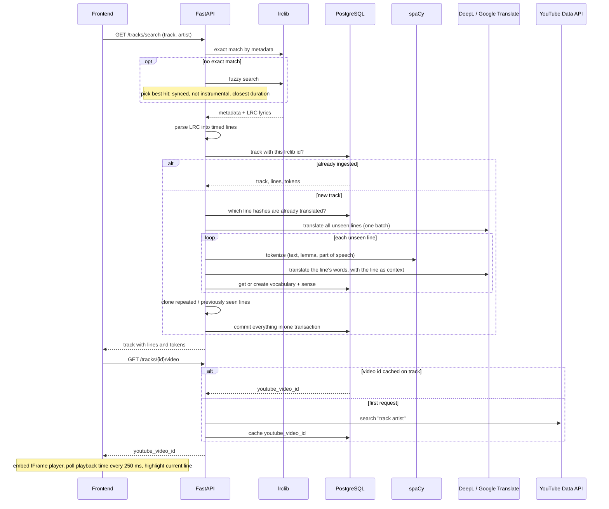
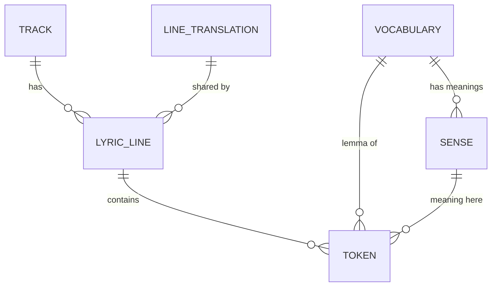

# Spivmova
*Learning Ukrainian through song*

## About
**Spiv** (спів, *singing*) + **Mova** (мова, *language*).

Spivmova makes learning Ukrainian through music more approachable by letting you interact with the lyrics as the song plays. Search for a song, and Spivmova pulls its time-synced lyrics, plays the music video alongside them, and highlights each line karaoke-style. Hover over a word to see its translation, show line translations always, on hover, or not at all, and click a line to jump to that point in the song.

### Featured song
<details>
    <summary><b>Пісня буде поміж нас</b>, Володимир Івасюк </summary>
    <p><i>This Song Will Remain Among Us</i>, Volodymyr Ivasyuk</p>
</details>

https://youtu.be/RzZHYHO0Pjw

## Features
- **Song search**: look up a track by title and artist; lyrics are fetched from [lrclib](https://lrclib.net) and stored for future calls.
- **Synced lyrics**: lines highlight and auto-scroll in time with the YouTube player.
- **Seek by line**: click a lyric line to jump the video to it.
- **Word and line translation**: lyrics are tokenized with spaCy's Ukrainian model and translated to English with DeepL / Google Translate, words are translated within the context of their line.
- **Efficient ingestion**: translations are batched, repeated lines (choruses) reuse existing translations, and each song's YouTube video ID is looked up once and cached to save API quota.

## How it works

### Request flow
Loading a song takes two requests. The first fetches the lyrics (translating and saving them at the first request). The second finds the YouTube video, so lyrics can render without waiting on YouTube.



### Data model


### Design choices

**Line deduplication.** Each line's text is hashed (SHA-256), and `LineTranslation` is unique per hash and shared across all songs. When a song is ingested, only lines never seen before get tokenized and translated. Repeated lines, like a chorus or a line already in another song, are cloned: they get a new `LyricLine` with their own position and timestamp, but reuse the existing translation, vocabulary and senses, so they cost no API calls. The tradeoff is that each line is translated on its own, without the whole song as context, because the translation has to stay valid in every song that contains that line. (Words are translated in the context of their line).

**spaCy finds the dictionary form of each word.** Ukrainian is heavily inflected, so one word appears in many forms (пісня, пісні, пісню, піснею). spaCy's `uk_core_news_sm` model gives each token its lemma and part of speech, and `Vocabulary` is unique on `(lemma, POS)`, so all of those forms map to one entry. A **sense** is a vocabulary entry paired with an English translation. The same word can mean different things in different lines, so each distinct meaning is stored as its own sense, along with an example line. Every token links to both its vocabulary entry and the sense it has in that line. Punctuation is kept as tokens for display but never translated.

**Async I/O.** All network and database calls are non-blocking: one shared `httpx.AsyncClient` (created at startup, with connection pooling) and `asyncpg`. Within a single request, the steps run one after another. spaCy tokenization is CPU-bound and runs synchronously. Ingestion commits once, at the end, so a translation failure partway through never leaves a half-saved song.

**Saving YouTube quota.** A YouTube search costs 100 of the 10,000 free daily quota units. The video is looked up only when a track is first played, then cached on the track for good. `PUT /tracks/{id}/video` lets you correct a bad match, and a manual override always wins.


### API
| Endpoint | Purpose |
|---|---|
| `GET /tracks/search` | Find a song, ingesting and translating it on first request |
| `GET /tracks/{id}/video` | Get the YouTube video for a track (searched once, then cached) |
| `PUT /tracks/{id}/video` | Manually set the video for a track (overrides the cached one) |

## Built With
**Backend**: Python 3.12, FastAPI, SQLAlchemy (async), Alembic, PostgreSQL, spaCy, Docker  
**Frontend**: TypeScript, React, Vite, Motion  
**APIs**: lrclib, DeepL, YouTube Data API v3, Google Cloud Translation (in progress)  

## Getting Started
> The project's website is not live yet. To run your own local instance, follow the steps below.

### Prerequisites
- [uv](https://docs.astral.sh/uv/) (Python package manager)
- [Node.js](https://nodejs.org/) (for the frontend)
- [Docker](https://www.docker.com/) (for PostgreSQL)
- A [DeepL API key](https://www.deepl.com/pro-api) (1-time, 1 Million free characters)
- Or a [Google Cloud Translation API key](https://cloud.google.com/translate/docs/setup) (500k tokens per month free, which is consumed at a higher rate than DeepL)
- A [YouTube Data API v3 key](https://developers.google.com/youtube/v3/getting-started) (the free quota is 10,000 units/day, and each video search costs 100)

### 1. Clone and install
```bash
git clone https://github.com/vsmar/spivmova.git
cd spivmova
uv sync
```

### 2. Start PostgreSQL
```bash
docker run --name spivmova-db \
  -e POSTGRES_USER=spivmova -e POSTGRES_PASSWORD=<password> -e POSTGRES_DB=spivmova \
  -p 5432:5432 -v spivmova_pgdata:/var/lib/postgresql/data \
  -d postgres:16
```
After the first run, start it again with `docker start spivmova-db`.

### 3. Configure `.env`
Create a `.env` file in the project root:
```env
DATABASE_URL=postgresql+asyncpg://spivmova:<password>@localhost:5432/spivmova
DEEPL_API_KEY=<your DeepL key>
YOUTUBE_API_KEY=<your YouTube key>
GOOGLE_CLOUD_PROJECT_ID=<your GCP project id>
```
`GOOGLE_CLOUD_PROJECT_ID` is required by the config, but the app doesn't use Google Translate yet, so any placeholder value works for now.

### 4. Run database migrations
```bash
uv run alembic upgrade head
```

### 5. Start the backend
```bash
uv run uvicorn spivmova.main:app --reload --port 8000
```

### 6. Start the frontend
```bash
cd frontend
npm install
npm run dev
```
Open http://localhost:5173.

### Running tests
```bash
uv run pytest                  # unit tests (external APIs mocked)
uv run pytest -m integration   # hits the real APIs and uses quota
```

## In the works
- Google Cloud Translation as an alternative to DeepL
- Better song matching (transliterated titles, fuzzy matching)
- Detecting lyrics in other languages and handling them during translation
- Spotify Premium playback
- Song recommendations from already-ingested tracks, and playlist import
- Clearer handling of rate limits and API errors

## Dedication
*Special thanks to Julia for planting the seeds of this project back in 2019.*
